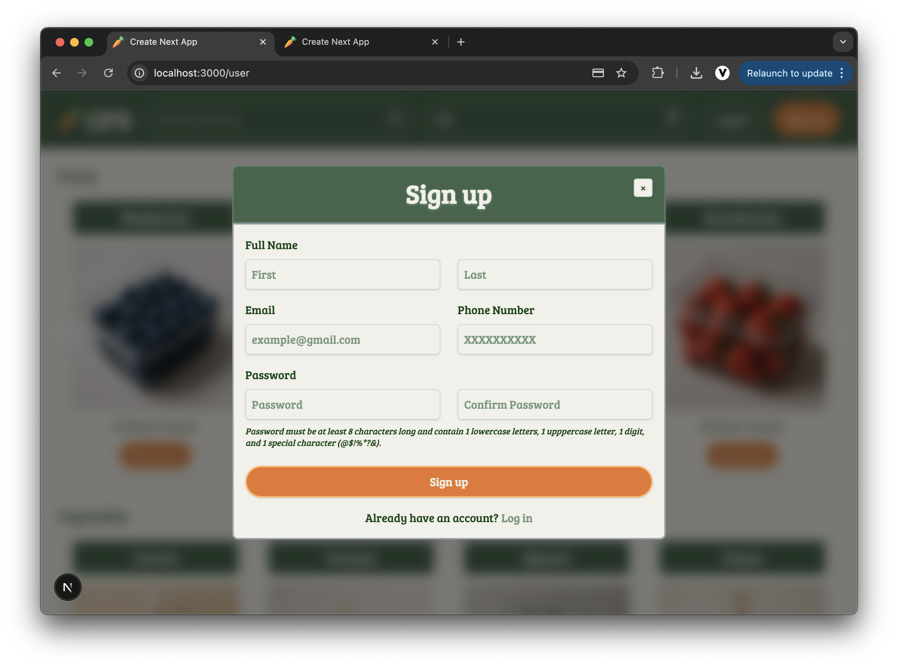

# 🛒 OFS – Online Food Store

**OFS** is a full-stack grocery shopping application powered by Docker containers and built with a **Next.js** frontend, a **Flask** backend, and a **MySQL** database. Customers can browse and order products, while admins manage inventory and dispatch deliveries using a robot-based system with optimized routing.

---

## 🚀 Features

- 🛍️ **Product Browsing** – categorized grocery items
- 🛒 **Cart and Checkout** – full order pipeline
- 🧑‍💼 **Admin Dashboard** – product & order management
- 📍 **Map-Based Address Selection** – with geolocation validation
- 📡 **Route Optimization** – Mapbox API for delivery sequencing
- 🤖 **Delivery Robot Dispatcher**
  - Max payload: **200 lbs**
  - Max batch: **10 orders**
- 💳 **Stripe Integration** – secure credit card payments (PaymentIntent API)

---

## 🧰 Tech Stack

| Layer    | Tech Used                                     |
| -------- | --------------------------------------------- |
| Frontend | Next.js, React, Tailwind CSS                  |
| Backend  | Python (Flask), REST API                      |
| Database | MySQL (custom schema)                         |
| DevOps   | Docker, Docker Compose                        |
| Payments | Stripe API (`@stripe/react-stripe-js`, SDK)   |
| Geo API  | Mapbox GL JS, Geocoding API, Optimization API |

---

## 🌍 External APIs Used

### 🔐 Stripe API

- `PaymentIntent` for real-time card payments
- `CardElement` for secure, styled form fields
- Integrated in both frontend and backend

### 🗺️ Mapbox API

- **GL JS** – interactive maps for admin/user dashboards
- **Geocoding API** – reverse-geolocation for validating user delivery addresses
- **Optimization API** – efficient delivery sequencing

---

## 🔐 API Keys Setup (Mapbox & Stripe)

To run this project successfully, you'll need your own **Mapbox** and **Stripe** accounts. These services require API tokens to authenticate requests:

### 🗺️ Mapbox Setup

1. Go to [https://account.mapbox.com/](https://account.mapbox.com/) and create an account.
2. Copy your **Access Token** from the dashboard.
3. Add it to your `.env` as:

```env
NEXT_PUBLIC_MAPBOX_ACCESS_TOKEN=your_mapbox_token
```

### 💳 Stripe Setup

1. Visit [https://dashboard.stripe.com/register](https://dashboard.stripe.com/register) to create a Stripe account.
2. Go to the **Developers → API Keys** section of your Stripe dashboard.
3. Copy the **Publishable Key** and **Secret Key** from the **Test mode** section.
4. Add them to your `.env`:

```env
NEXT_PUBLIC_STRIPE_PUBLISHABLE_KEY=pk_test_...
STRIPE_SECRET_KEY=sk_test_...
```

---

## 💳 Stripe Test Card for Checkout

Since this app runs in Stripe's test mode, use the following dummy card to test purchases:

| Field        | Value               |
| ------------ | ------------------- |
| Card Number  | 4242 4242 4242 4242 |
| Expiry Date  | Any future date     |
| CVC          | Any 3-digit number  |
| ZIP / Postal | Any 5-digit number  |

> No real money is charged — this is purely for testing with Stripe’s sandbox.

---

## 🐳 Running the Project with Docker

### 1. 📁 Clone the Repository

If you only want the `OFS` folder from a larger repo:

```bash
git clone --filter=blob:none --no-checkout https://github.com/Sereyvidya/Projects.git
cd Projects
git sparse-checkout init --cone
git sparse-checkout set OFS
git checkout main
```

Or download the full repo:  
[📦 Download Full Repository ZIP](https://github.com/Sereyvidya/Projects/archive/refs/heads/main.zip)

---

### 2. 🐋 Build and Run with Docker

```bash
docker-compose up --build
```

This will start:

- 🧑‍🎨 Frontend at [http://localhost:3000](http://localhost:3000)
- 🐍 Flask backend
- 🐬 MySQL database with seeded schema

---

### 🔁 Optional Docker Commands

```bash
docker-compose down -v                        # Stop & wipe data
docker-compose down                           # Stop but retain data
docker-compose up -d --build                  # Run in background
docker-compose --profile seed run --rm seed_database  # Seed the database
```

---

### 3. 🔑 Environment Variables

Sample `.env` values to place in your backend/frontend:

```env
# Backend
STRIPE_SECRET_KEY=sk_test_...

# Frontend
NEXT_PUBLIC_STRIPE_PUBLISHABLE_KEY=pk_test_...
NEXT_PUBLIC_MAPBOX_ACCESS_TOKEN=your_mapbox_token

# DB
MYSQL_USER=root
MYSQL_PASSWORD=password
MYSQL_HOST=database
MYSQL_PORT=3306
MYSQL_DATABASE=OFS
JWT_SECRET_KEY=super_secure_jwt_key
```

---

## 🌐 Access the Application

| Interface      | URL                         |
| -------------- | --------------------------- |
| 🧑‍🎓 User Panel  | http://localhost:3000/user  |
| 🧑‍💼 Admin Panel | http://localhost:3000/admin |

---

## 📸 Some Screenshots

### User product grid & filtering


### Sign up form



### User cart view


### Address selection map


### Order summary & Stripe checkout


### Admin delivery dashboard


### Admin edit product modal


## 📄 License

This project is licensed under the MIT License. See the [LICENSE](LICENSE) file for details.
